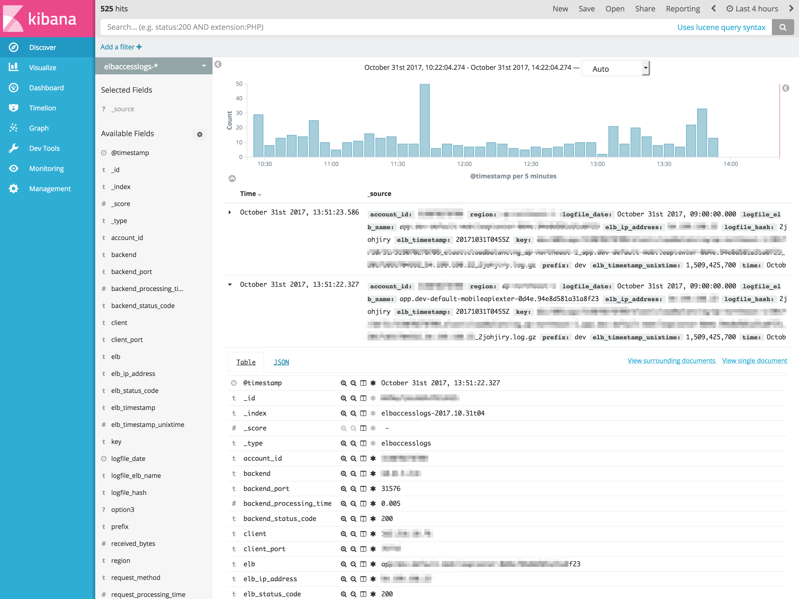

[](https://microbadger.com/images/dailyhotel/labelgun "Get your own image badge on microbadger.com")

# elb-to-elasticsearch

Fluentd Docker image, which ships AWS ELB/ALB logs to Elasticsearch.



## Kubernetes usages

``` yaml
apiVersion: extensions/v1beta1
kind: Deployment
metadata:
  name: elb-logshipper
spec:
  replicas: 1
  template:
    metadata:
      labels:
        app: elb-logshipper
    spec:
      containers:
      - image: dailyhotel/elb-to-elasticsearch:latest
        imagePullPolicy: Always
        name: elb-logshipper
        env:
          - name: AWS_ACCESS_KEY_ID
            value: MY_KEY
          - name: AWS_SECRET_ACCESS_KEY
            value: MY_SECRET
          - name: AWS_REGION
            value: ap-northeast-1
          - name: AWS_S3_BUCKETNAME
            value: my-access-logs
          - name: AWS_S3_PREFIX
            value: dev
          - name: ES_HOSTNAME
            value: my.es.io
          - name: ES_USERNAME
            value: fluentd
          - name: ES_PASSWORD
            value: MY_PASSWORD
          - name: ES_PORT
            value: "9243"
          - name: ES_SCHEME
            value: https
```


In case that you want to use Kafka as a log stream buffer:

``` yaml
apiVersion: extensions/v1beta1
kind: Deployment
metadata:
  name: elb-to-kafka
spec:
  replicas: 1
  template:
    metadata:
      labels:
        app: elb-to-kafka
        role: elb-accesslogs
    spec:
      containers:
      - image: dailyhotel/elb-to-elasticsearch:s3-to-kafka
        imagePullPolicy: Always
        name: elb-to-kafka
        env:
          - name: AWS_ACCESS_KEY_ID
            value: MY_KEY
          - name: AWS_SECRET_ACCESS_KEY
            value: MY_SECRET
          - name: AWS_REGION
            value: ap-northeast-1
          - name: AWS_S3_BUCKETNAME
            value: my-access-logs
          - name: AWS_S3_PREFIX
            value: dev
          - name: KAFKA_BROKERS
            value: kafka-0.broker:9092,kafka-1.broker:9092,kafka-2.broker:9092
          - name: KAFKA_ZK
            value: zookeeper:2181
          - name: KAFKA_TOPIC
            value: elb-accesslogs
```

``` yaml
apiVersion: extensions/v1beta1
kind: Deployment
metadata:
  name: elb-to-es
spec:
  replicas: 1
  template:
    metadata:
      labels:
        app: elb-to-es
        role: elb-accesslogs
      # This annotation ensures that fluentd does not get evicted if the node
      # supports critical pod annotation based priority scheme.
      # Note that this does not guarantee admission on the nodes (#40573).
      annotations:
        scheduler.alpha.kubernetes.io/critical-pod: ''
    spec:
      containers:
      - image: dailyhotel/elb-to-elasticsearch:kafka-to-es
        imagePullPolicy: Always
        name: elb-to-es
        env:
          - name: KAFKA_BROKERS
            value: kafka-0.broker:9092,kafka-1.broker:9092,kafka-2.broker:9092
          - name: KAFKA_ZK
            value: zookeeper:2181
          - name: KAFKA_TOPIC
            value: elb-accesslogs
          - name: KAFKA_CONSUMER_GROUP
            value: elb-to-es-group
          - name: ES_HOSTNAME
            value: my.es.io
          - name: ES_USERNAME
            value: fluentd
          - name: ES_PASSWORD
            value: MY_PASSWORD
          - name: ES_PORT
            value: "9243"
          - name: ES_SCHEME
            value: https
          - name: RETRY_LIMIT
            value: "1"
          - name: NUM_THREADS
            value: "2"
```

## See 

- [shinsaka/fluent-plugin-elb-log
](https://github.com/shinsaka/fluent-plugin-elb-log)
- [Enable Access Logs for Your Classic Load Balancer](http://docs.aws.amazon.com/elasticloadbalancing/latest/classic/enable-access-logs.html)
- [Enable access logging for ALBs created with alb-ingress-controller · Issue #90 · coreos/alb-ingress-controller](https://github.com/coreos/alb-ingress-controller/issues/90)